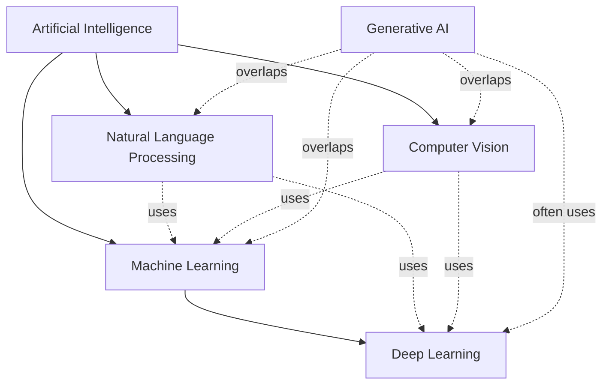

# AI Landscape

Artificial intelligence (AI) is the broad field of building systems that perform tasks associated with human intelligence, such as perception, reasoning, learning, and language use.

## Relationship Map

The categories describe related but different dimensions of the field. AI is the umbrella discipline. Machine learning (ML) is an approach within AI in which systems learn patterns from data rather than relying only on hand-written rules. Deep learning (DL) is a family of ML methods based on multi-layer neural networks. Natural language processing (NLP) and computer vision (CV) are application and research areas focused on language and visual information. Generative AI is a capability that cuts across these areas: it produces new text, images, audio, video, code, or other data, usually with ML and often DL underneath.