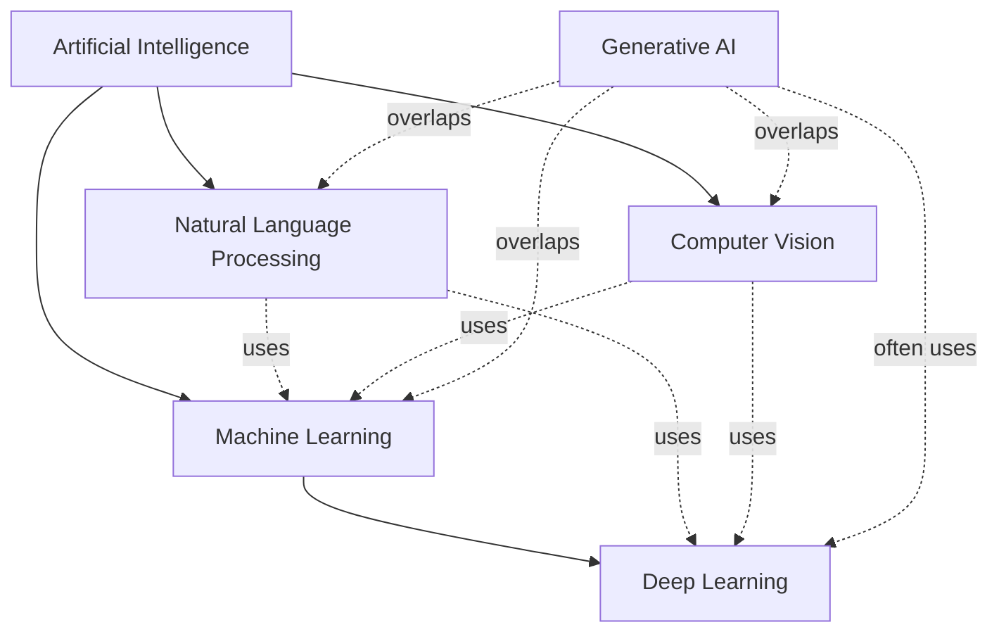

# AI Landscape

Artificial intelligence (AI) is the broad field of building systems that perform tasks associated with human intelligence, such as perception, reasoning, learning, and language use.

## Relationship Map

The categories describe related but different dimensions of the field. AI is the umbrella discipline. Machine learning (ML) is an approach within AI in which systems learn patterns from data rather than relying only on hand-written rules. Deep learning (DL) is a family of ML methods based on multi-layer neural networks. Natural language processing (NLP) and computer vision (CV) are application and research areas focused on language and visual information. Generative AI is a capability that cuts across these areas: it produces new text, images, audio, video, code, or other data, usually with ML and often DL underneath.

## Major Subfields

### Machine Learning

Machine learning is the study of algorithms that learn relationships from examples and use those learned relationships to make predictions or decisions on new data. Instead of specifying every rule manually, developers choose a model, provide data, and evaluate how well the model generalizes.

Common uses include:

- Detecting fraudulent credit-card transactions from transaction patterns.
- Recommending products, films, or articles based on user and item behavior.
- Forecasting demand, energy consumption, or equipment failures.

### Deep Learning

Deep learning is a branch of machine learning that uses neural networks with many processing layers. These models can learn useful representations directly from large amounts of raw or lightly processed data, which makes them especially effective for language, images, audio, and other high-dimensional inputs.

Common uses include:

- Recognizing objects and events in photographs or video.
- Transcribing speech into text and identifying speakers or spoken language.
- Powering modern large language models and other foundation models.

### Natural Language Processing

Natural language processing focuses on enabling computers to work with human language, including written text and speech. NLP includes tasks that analyze language, such as classification and translation, as well as tasks that generate language.

Common uses include:

- Translating documents and conversations between languages.
- Classifying customer messages by topic, urgency, or sentiment.
- Searching documents by meaning and answering questions over a knowledge base.

### Computer Vision

Computer vision focuses on extracting information from images, video, and other visual signals. A vision system may classify an entire image, locate objects, segment regions, or interpret changes across a video stream.

Common uses include:

- Inspecting manufactured parts for defects on a production line.
- Helping vehicles detect lanes, pedestrians, signs, and nearby vehicles.
- Supporting medical-image analysis, such as highlighting suspicious regions for review.

### Generative AI

Generative AI refers to systems that create new content from a prompt, examples, or other conditions. The generated result is sampled from patterns learned during training; it is not necessarily a retrieval of a single stored answer. Generative systems can work with language, images, audio, video, and code.

Common uses include:

- Drafting, revising, and summarizing text or software code.
- Creating concept images, design variations, or synthetic training data.
- Generating speech, music, captions, or video from text and other inputs.

## Named Examples

The category in this table identifies the most useful primary lens for each example. Several examples belong to more than one area in practice; for example, a deep-learning model may perform an NLP task and also provide a generative capability.

| Example | Primary subfield | Description |
| --- | --- | --- |
| Spam email filter | Machine Learning | Learns from labeled messages to classify incoming email as spam or legitimate. |
| Netflix recommendation system | Machine Learning | Predicts which films or shows a viewer may prefer from behavior and item patterns. |
| Predictive maintenance model | Machine Learning | Estimates whether equipment is likely to fail based on sensor readings and maintenance history. |
| AlphaFold | Deep Learning | Uses deep neural networks to predict the three-dimensional structures of proteins from their amino-acid sequences. |
| Automatic speech recognition | Deep Learning | Converts spoken audio into text using neural models trained on speech and transcripts. |
| Machine translation | Natural Language Processing | Produces an equivalent sentence in another human language while modeling meaning and grammar. |
| Sentiment analysis | Natural Language Processing | Labels text according to expressed opinions or emotional tone, such as positive, neutral, or negative. |
| Google Search language understanding | Natural Language Processing | Interprets a search query and its context so results can match the user's intent rather than only exact words. |
| Face detection in a camera | Computer Vision | Locates faces in an image or video frame without necessarily identifying the people. |
| Manufacturing defect inspection | Computer Vision | Finds scratches, missing components, or other visual defects in product images. |
| ChatGPT | Generative AI | Generates and transforms text in response to natural-language instructions. |
| DALL-E | Generative AI | Generates or edits images from textual descriptions and related visual instructions. |

## LLM Fundamentals

Large language models (LLMs) are deep-learning models trained to work with sequences of language. During training, an LLM learns statistical relationships among tokens and uses those relationships to predict likely continuations. That prediction process can support generation, classification, extraction, and question answering, but a fluent response is not a guarantee that every claim is correct.

### Tokens and Tokenization

A token is a piece of text that a language model processes as one unit. A token may be a whole word, part of a word, punctuation, or whitespace-related text, depending on the tokenizer. Tokenization is the process of converting an input string into a sequence of token IDs, and converting generated token IDs back into text.

For example, a tokenizer might split `unhelpful` into pieces such as `un` and `helpful`, while keeping a short common word as one token. The exact split depends on the model's vocabulary. Token counts matter because model cost, processing time, and the amount of text that fits in one request are measured in tokens rather than characters or words.

### Embeddings

An embedding is a numerical vector that represents a token, piece of text, image, or other item in a space where related meanings tend to have related positions. A model converts token IDs into vectors before processing them. These vectors are learned representations, not dictionary definitions: their meaning comes from how they interact with other representations and model parameters.

Embeddings are also useful outside text generation. A search system can compare an embedded query with embedded documents to find semantically related passages, even when the query and document use different words.

### Transformers

The transformer is a neural-network architecture designed to process relationships among elements in a sequence. Unlike a simple left-to-right recurrence, a transformer can connect information across many positions using attention and can process training sequences efficiently in parallel. Modern LLMs commonly use transformer layers alongside token embeddings, feed-forward networks, normalization, and output layers.

### Attention

Attention lets the model assign different amounts of importance to other tokens when updating its representation of a token. A useful analogy is reading a sentence while answering a question: when deciding what `it` refers to, you look back at the nouns and surrounding clues that best resolve the reference instead of treating every earlier word as equally important.

In a transformer, attention computes learned comparisons between tokens and combines information from the most relevant positions. In a causal language model, a token can attend only to the current position and earlier positions when predicting the next token. This preserves the left-to-right generation rule while allowing each prediction to use a broad, context-dependent view of the preceding text.

### Context Windows

A context window is the maximum number of tokens a model can consider in one request, including the input instructions, conversation history, retrieved material, and often the requested output. It is a per-request processing limit, not the same thing as the model's training data size or permanent memory.

When a prompt exceeds the context window, an application must shorten it, summarize it, retrieve fewer passages, or split the task into multiple requests. Staying within the limit does not by itself make an answer accurate; it only ensures that the model can process the supplied context.