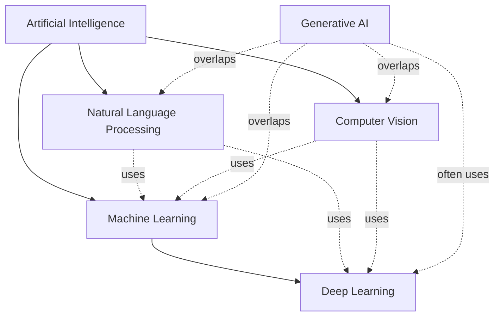

# AI Landscape

Artificial intelligence (AI) is the broad field of building systems that perform tasks associated with human intelligence, such as perception, reasoning, learning, and language use.

## Relationship Map

The categories describe related but different dimensions of the field. AI is the umbrella discipline. Machine learning (ML) is an approach within AI in which systems learn patterns from data rather than relying only on hand-written rules. Deep learning (DL) is a family of ML methods based on multi-layer neural networks. Natural language processing (NLP) and computer vision (CV) are application and research areas focused on language and visual information. Generative AI is a capability that cuts across these areas: it produces new text, images, audio, video, code, or other data, usually with ML and often DL underneath.

## Major Subfields

### Machine Learning

Machine learning is the study of algorithms that learn relationships from examples and use those learned relationships to make predictions or decisions on new data. Instead of specifying every rule manually, developers choose a model, provide data, and evaluate how well the model generalizes.

Common uses include:

- Detecting fraudulent credit-card transactions from transaction patterns.
- Recommending products, films, or articles based on user and item behavior.
- Forecasting demand, energy consumption, or equipment failures.

### Deep Learning

Deep learning is a branch of machine learning that uses neural networks with many processing layers. These models can learn useful representations directly from large amounts of raw or lightly processed data, which makes them especially effective for language, images, audio, and other high-dimensional inputs.

Common uses include:

- Recognizing objects and events in photographs or video.
- Transcribing speech into text and identifying speakers or spoken language.
- Powering modern large language models and other foundation models.

### Natural Language Processing

Natural language processing focuses on enabling computers to work with human language, including written text and speech. NLP includes tasks that analyze language, such as classification and translation, as well as tasks that generate language.

Common uses include:

- Translating documents and conversations between languages.
- Classifying customer messages by topic, urgency, or sentiment.
- Searching documents by meaning and answering questions over a knowledge base.

### Computer Vision

Computer vision focuses on extracting information from images, video, and other visual signals. A vision system may classify an entire image, locate objects, segment regions, or interpret changes across a video stream.

Common uses include:

- Inspecting manufactured parts for defects on a production line.
- Helping vehicles detect lanes, pedestrians, signs, and nearby vehicles.
- Supporting medical-image analysis, such as highlighting suspicious regions for review.

### Generative AI

Generative AI refers to systems that create new content from a prompt, examples, or other conditions. The generated result is sampled from patterns learned during training; it is not necessarily a retrieval of a single stored answer. Generative systems can work with language, images, audio, video, and code.

Common uses include:

- Drafting, revising, and summarizing text or software code.
- Creating concept images, design variations, or synthetic training data.
- Generating speech, music, captions, or video from text and other inputs.